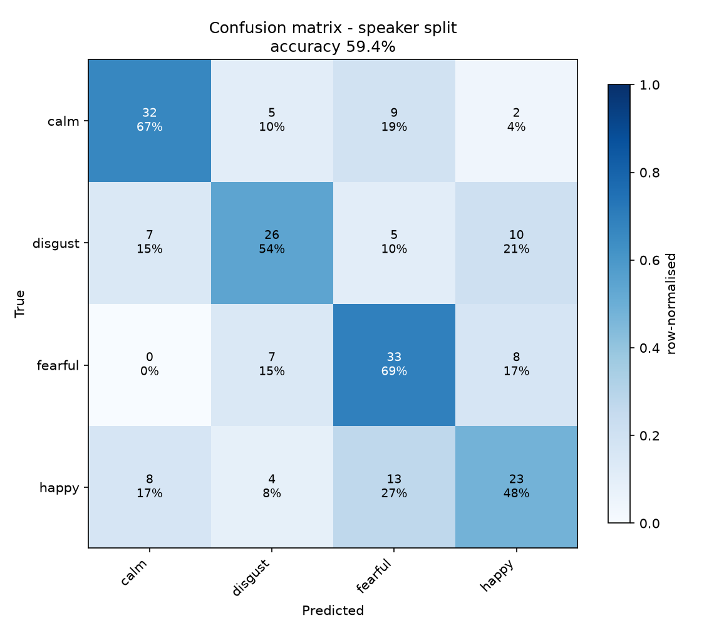
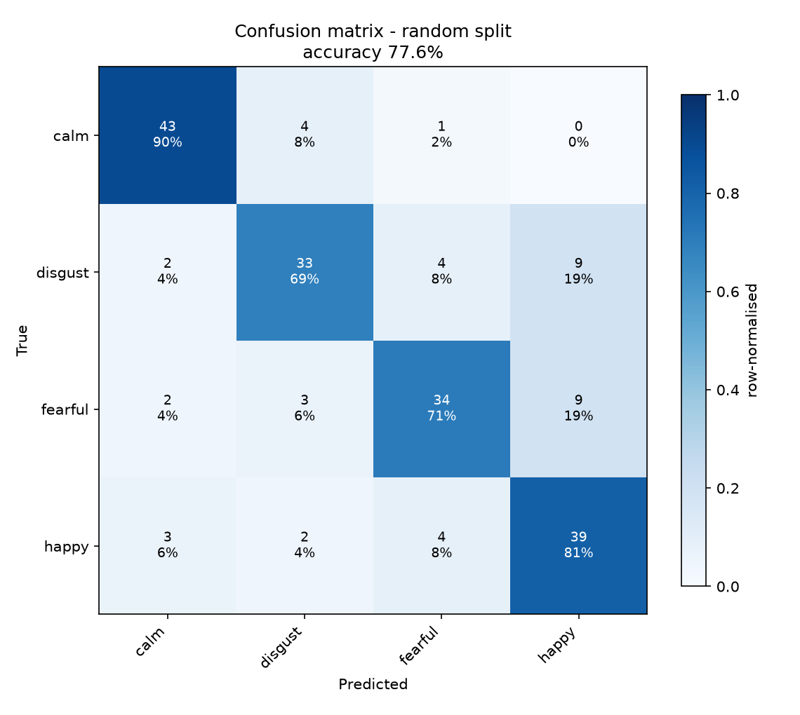
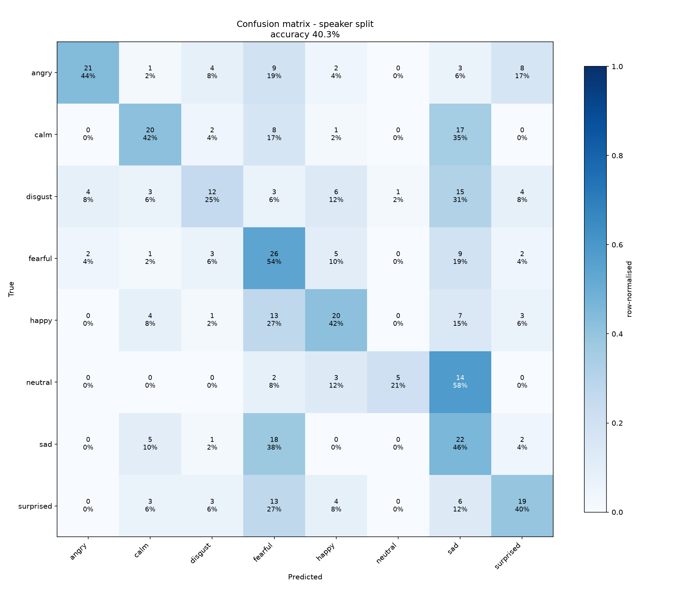
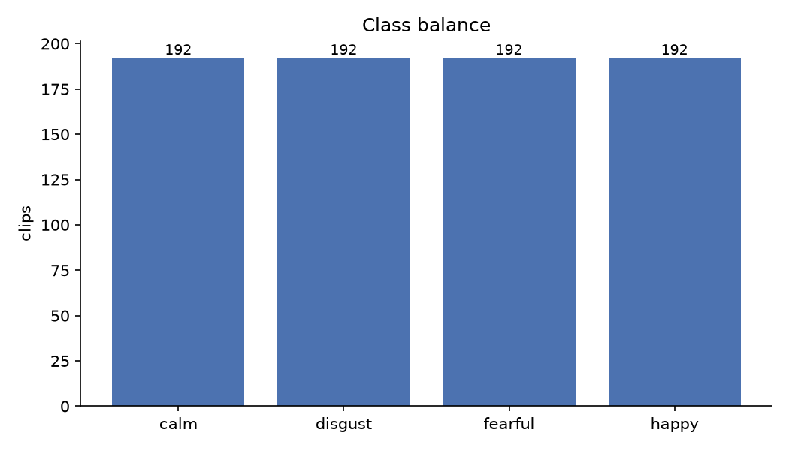
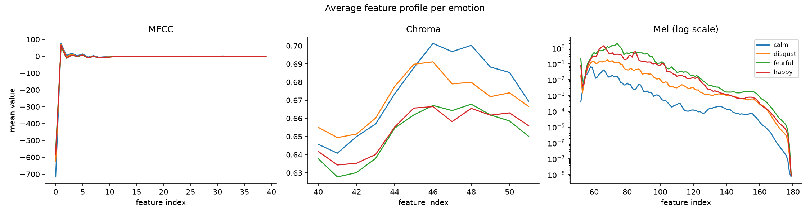

# Results

All numbers below were produced by the code in this repository on the full
RAVDESS speech set (1,440 clips, 24 actors). Every run is seeded
(`random_state=9`) and reproducible with the command shown.

Environment: Python 3.14.2, librosa 1.0.0, scikit-learn 1.9.1, numpy 2.5.3 (macOS / arm64).

---

## Headline

| Classes | Split | Held-out accuracy | Cross-validated | Macro F1 |
|---|---|---:|---:|---:|
| 4 (`calm`, `happy`, `fearful`, `disgust`) | **random** | **77.60%** | 81.51% ± 3.12% | 0.775 |
| 4 | **speaker-independent** | **59.38%** | 57.56% ± 3.83% | 0.592 |
| 8 (all) | random | 66.94% | 69.51% ± 3.30% | 0.654 |
| 8 (all) | speaker-independent | 40.28% | 40.10% ± 3.10% | 0.408 |

Random-guess floor: 25% for 4 classes, 12.5% for 8.

Cross-validation scheme matches the split: `StratifiedKFold(shuffle=True)` for
random, `GroupKFold` by actor for speaker-independent.

---

## The finding: an 18-point gap

**77.60% → 59.38%.** Same data, same features, same model, same
hyper-parameters. The *only* difference is whether the test speakers also
appear in training.

| | Random split | Speaker-independent |
|---|---:|---:|
| 4-class held-out | 77.60% | 59.38% |
| 4-class CV | 81.51% | 57.56% |
| 8-class held-out | 66.94% | 40.28% |

The random split lets the same 24 voices sit on both sides. Each actor
contributes 60 clips, so the model can score well by recognising **voices**
instead of **emotions**, *"this timbre is actor 14, and actor 14's happy clips
sound like this."* On a speaker it has never heard, that shortcut is worth
nothing, and roughly 18 points of the headline number evaporate.

The 8-class case is starker: **66.94% → 40.28%**, a 27-point drop. More classes
means more room for the voice-identity shortcut to do the work.

Typical published tutorial numbers for this setup sit around 72–78%. They are
all random-split numbers. **59.38% is the number that would survive contact with
a new speaker**, and it is the one this project reports as its real result.

> The generalisable rule: if your data has a grouping structure (speakers,
> patients, users, devices, sessions), a random split leaks it and inflates your
> score. Split on the group. Nothing crashes when you get this wrong; the number
> just looks good.

---

## 4-class, speaker-independent (the real result)

Held-out actors: **4, 5, 6, 8, 10, 19**, never heard during training
(verify with `GroupShuffleSplit(n_splits=1, test_size=0.25, random_state=9)`).

```
              precision    recall  f1-score   support

        calm       0.68      0.67      0.67        48
     disgust       0.62      0.54      0.58        48
     fearful       0.55      0.69      0.61        48
       happy       0.53      0.48      0.51        48

    accuracy                           0.59       192
   macro avg       0.60      0.59      0.59       192
```



`calm` is the easiest class (67% recall), it is the only low-arousal emotion in
the subset, so it is separable on energy alone. `happy` is the hardest (48%),
and its errors are revealing: 27% of happy clips are called `fearful`. Both are
high-arousal; what separates them is valence, which these features barely encode.

## 4-class, random split (the tutorial-comparable baseline)

```
              precision    recall  f1-score   support

        calm       0.86      0.90      0.88        48
     disgust       0.79      0.69      0.73        48
     fearful       0.79      0.71      0.75        48
       happy       0.68      0.81      0.74        48

    accuracy                           0.78       192
```



## All 8 emotions, speaker-independent

40.28% against a 12.5% floor, better than chance by a wide margin, but the
per-class recall is where the story is:

```
              precision    recall  f1-score   support
       angry       0.78      0.44      0.56        48
        calm       0.54      0.42      0.47        48
     disgust       0.46      0.25      0.32        48
     fearful       0.28      0.54      0.37        48
       happy       0.49      0.42      0.45        48
     neutral       0.83      0.21      0.33        24
         sad       0.24      0.46      0.31        48
   surprised       0.50      0.40      0.44        48

    accuracy                           0.40       360
```



Two systematic confusions, both pointing at the same cause:

1. **neutral → sad / calm.** `neutral` recall collapses to 21%: of 24 neutral
   clips, 14 are called `sad` and 2 `fearful`. High precision (0.83) with low
   recall means the model almost never *guesses* neutral, it has no confident
   acoustic signature for "no emotion."
2. **The high-arousal cluster blurs.** `fearful` absorbs errors from `sad`
   (18 clips), `surprised` (13), and `happy` (13); its precision drops to 0.28
   because it has become the model's default guess for "energetic."

Both are the same underlying limitation: **time-averaged spectral features
encode arousal much better than valence.** Angry and happy are both loud and
high-energy; what distinguishes them is pitch contour and context, exactly the
temporal information that averaging over frames throws away.

---

## Ablations

Every variant below is evaluated on **both** splits, because a change that helps
under a random split does not necessarily help on unseen speakers. 4-class
subset, held-out test accuracy, seed 9. Reproduce with
`python scripts/run_ablations.py`.

| Variant | Features | Random split | Speaker-independent | Gap |
|---|---:|---:|---:|---:|
| **MFCC + chroma + mel (full)** | 180 | **77.60%** | **59.38%** | 18.2 pp |
| MFCC only | 40 | 76.04% | 59.38% | 16.7 pp |
| Chroma only | 12 | 37.50% | 32.81% | 4.7 pp |
| Mel only | 128 | 61.98% | 51.04% | 10.9 pp |
| MFCC + chroma | 52 | 77.60% | 58.85% | 18.8 pp |
| MFCC + mel | 168 | 76.56% | 55.21% | 21.4 pp |
| Chroma + mel | 140 | 64.58% | 46.35% | 18.2 pp |
| Full, no `StandardScaler` | 180 | 71.35% | 50.52% | 20.8 pp |

Three things fall out of this table.

**1. MFCCs do almost all the work.** 40 MFCC features alone score 76.04% /
59.38%, statistically indistinguishable from the full 180-feature model, and
*identical* on the speaker-independent split. The other 140 columns buy about
1.5 points on the random split and nothing at all on unseen speakers.

This is not surprising once you notice that MFCCs are computed *from* the mel
spectrogram (mel → log → DCT). The DCT is a decorrelating compression: the 40
MFCCs are a more compact, better-conditioned encoding of what the 128 mel bands
already contain. Adding the raw mel bands back mostly adds correlated noise,
and on the speaker split, `MFCC + mel` is actually **4 points worse** than MFCC
alone (55.21% vs 59.38%), because the extra capacity is spent fitting
speaker-specific spectral detail that does not transfer.

**If this were going to production, the 40-feature MFCC-only model is the one to
ship**, same accuracy, 4.5× fewer features, faster to extract and to fit.

**2. Chroma is nearly useless here, but not harmful.** 12 chroma features score
37.50% alone, above the 25% floor, so there is *some* signal, but weak. That is
expected: chroma folds energy into 12 pitch classes for *musical* key detection,
and emotional speech is not tonal in that sense. It neither helps nor hurts in
combination.

**3. Scaling matters more than any feature choice.** Dropping `StandardScaler`
costs 6.25 points on the random split and **8.9 points** on the speaker split,
a bigger swing than removing 140 of the 180 features. The 180 columns span
wildly different ranges (MFCC coefficient 0 reaches the hundreds, chroma sits in
[0, 1]), and unscaled gradient descent wastes its early epochs correcting for
that imbalance instead of learning.

The scaler lives inside a `Pipeline`, so it is fit on the training fold only and
cannot leak test statistics, including inside every cross-validation fold.

> **A note on convergence:** some ablation variants emit sklearn's
> `ConvergenceWarning`, the MLP hits `max_iter=500` without the loss
> plateauing. The unscaled variant is the worst offender, which is the same
> story from a different angle: bad conditioning means slower optimisation.
> `max_iter` is left at the published value so the comparison stays fair
> rather than being tuned per variant.

## Supporting figures

| | |
|---|---|
|  | **Class balance.** The 4-class subset is perfectly balanced at 192 clips each, so accuracy is a fair metric. |
|  | **Mean feature vector per emotion.** The curves separate, most visibly in the mel band, confirming the features carry emotion signal before any model is fit. |

---

## Verification

`python scripts/verify_results.py` re-derives the published numbers and measures
how far to trust them. It needs the feature cache, so it runs locally rather than
in CI. Output: `reports/verification.json`.

| Check | Result |
|---|---|
| Reproduction | All four headline accuracies **and** their confusion matrices regenerate exactly |
| Speaker leakage | None, test actors 4, 5, 6, 8, 10, 19 never appear in training |
| Seed spread, baseline (10 seeds) | **58.28% ± 1.18%** (range 56.25%–59.90%). The published 59.38% uses seed 9, fixed at the start, which sits near the top of that range |
| 95% bootstrap, resampling clips | [52.6%, 66.1%] |
| 95% bootstrap, resampling speakers | **[49.5%, 68.2%]** |
| Per-speaker accuracy | 41% (actor 10) to 75% (actor 8) |
| Permutation test, 30 shuffles | 62.11% vs 25.10% on shuffled labels; p = 0.032, the smallest value 30 shuffles can produce |

Clips from one speaker are not independent, each test speaker contributes 32,
so the **speaker-level interval is the one to trust**, and it is about 19 points
wide. With six test speakers, a difference of a few points between two
configurations cannot be resolved. That limits everything in the next section.

---

## Trying to beat the baseline

`python scripts/improve_accuracy.py` · full 30-row table in
[`reports/improvements.md`](../reports/improvements.md).

**Protocol.** Every candidate (2 poolings × 5 classifiers × 3 speaker
normalisations) is scored with `GroupKFold(6)` over the 18 training actors. The
held-out actors are used only once per configuration reported below. Choosing
the best of 30 on the test actors would repeat the random-split mistake one
level up.

| Role | Configuration | Inner CV | Held-out, seed 9 | Held-out, 10 seeds |
|---|---|---:|---:|---:|
| Baseline | MLP, mean pooling | 60.9% | 59.38% | 58.28% ± 1.18% |
| Best deployable | MLP, mean+std pooling, neutral-clip speaker normalisation | 69.3% | 63.54% | 61.72% ± 1.40% |
| Upper bound, **not deployable** | Logistic regression, mean+std, oracle speaker normalisation | 73.4% | 69.79% | deterministic |

**Is the gain real? Six held-out speakers cannot say.**

- McNemar's exact test, baseline vs best deployable: baseline-only correct 25,
  best-only correct 33, **p = 0.36**.
- Speaker-level bootstrap interval for the accuracy gain: **[−3.1, +10.4] points**, it includes zero.
- Across seeds the gap is about +3.4 points, larger than either model's seed
  spread, but this test set cannot confirm it.

On this single split the search produced a candidate, not a result. The
nested cross-validation below asks the same question of all 24 speakers and
does resolve it.

**What the search did establish:**

1. **Representation beat model choice.** Adding standard deviation over time
   (`--pooling meanstd`, 360 features) moved every classifier by more than
   switching classifiers did, MLP inner CV 60.9% → 66.0%. The five model
   families usually landed within 3–4 points of each other on the same features.
2. **Speaker normalisation is flattered by this dataset.** Standardising each
   speaker with *all* their clips is the strongest option (73.4% inner CV), but it
   is not deployable: every RAVDESS speaker recorded a perfectly emotion-balanced
   set, so their average is emotion-free by construction. Normalising with just
   that speaker's 4 neutral clips (something a real system could ask a user to
   record) keeps part of the gain. It is not implemented in `predict.py`, because
   it needs enrolment recordings from every new speaker and its gain is unconfirmed.
3. **Selection bias, measured.** The winner of 20 deployable candidates lost
   **5.8 points** between inner CV and the held-out actors. The baseline, fixed in
   advance, lost 1.5. Picking the best of many is optimistic in exactly the way
   the theory says.

### Nested cross-validation: the same question, asked of all 24 speakers

`python scripts/nested_cv.py` · full tables in
[`reports/nested_cv.md`](../reports/nested_cv.md) · about 2 minutes.

Six held-out speakers could not settle it, so the whole selection procedure was
wrapped in an outer grouped loop. The outer `GroupKFold(6)` tests 4 actors per
fold. Inside each fold, `GroupKFold(5)` over the other 20 actors picks one of the
20 **deployable** configurations, which is then refit on the 20 and scored on
the 4. Every actor is a test speaker exactly once, and no test speaker influences
the choice made for its own fold. The baseline is fixed in advance and scored on
the same folds.

| Procedure | Accuracy over all 768 clips |
|---|---:|
| Baseline, MLP, mean pooling, no normalisation (5 seeds) | **60.55% ± 0.73%** |
| Nested search, then test | **69.27%** |

| Evidence | Result |
|---|---|
| Speaker-level bootstrap, 95% interval for the gain | **[+4.1, +13.7] points**, excludes zero |
| Wilcoxon signed-rank on the 24 per-speaker gains | **p = 0.006** |
| Speakers improved / worse / unchanged | 15 / 8 / 1 (sign test p = 0.21: ignores how large each change was) |
| Configuration chosen per outer fold | logistic regression, mean+std, neutral-clip normalisation ×4; histogram gradient boosting, same features ×2 |

**What this changes.** Under nested cross-validation over all 24 speakers, the
selection procedure scores 69.27% against the baseline's 60.55% on the same
768 clips, about **8.7 points**, with an interval that excludes zero. Compare
these two numbers only with each other: they come from a different test set
and protocol than the 59.38% headline (6 actors, 192 clips), and 60.55% is not
a correction of it. Six held-out speakers could not resolve a 3-point gap
(p = 0.36); all 24 resolve an 8.7-point one (Wilcoxon p = 0.006). Two consistent ingredients won every fold: **mean+std pooling** and
**normalising by a few neutral clips from the same speaker**. The classifier
varied between folds, which fits finding 1 above, the representation matters
more than the model.

**What it does not change.**
- The gain is uneven: 8 of 24 speakers got worse, by up to 9.4 points. For some
  individual users the "better" system would be worse.
- The winning setup needs **neutral enrolment clips from every new speaker**.
  `predict.py` and the app do not collect them, so the default model and the
  headline 59.38% stay as they are. Building enrolment is the concrete next step
  this result justifies.
- The McNemar p-values in the report (all < 0.001) treat the 768 clips as
  independent. They are not, so the speaker-level tests above are the ones to trust.

---

## Reproducing

```bash
python scripts/download_dataset.py                              # ~198 MB
python -m speech_emotion.train --split random  --cv 5           # 77.60%
python -m speech_emotion.train --split speaker --cv 5           # 59.38%
python -m speech_emotion.train --emotions all --split random  --cv 5
python -m speech_emotion.train --emotions all --split speaker --cv 5
python -m speech_emotion.train --split random --no-scaler       # ablation
python -m speech_emotion.visualize
python scripts/run_ablations.py
python scripts/verify_results.py                                # ~5 min
python scripts/improve_accuracy.py                              # ~5 min
python scripts/nested_cv.py                                     # ~2 min
```

The first run extracts features for all 1,440 clips (~1–2 minutes) and caches
them to `data/features_cache.npz`; later runs load the cache and finish in
seconds. Full metrics, including confusion matrices, are written to
`reports/metrics_<emotions>_<split>.json`.
